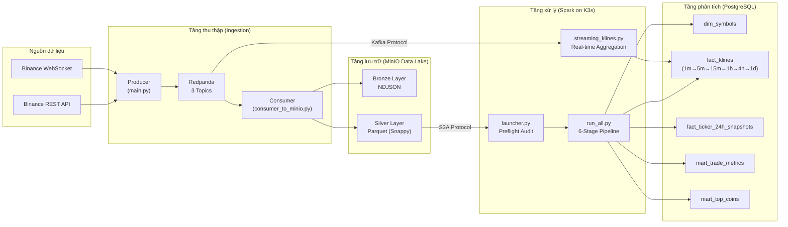
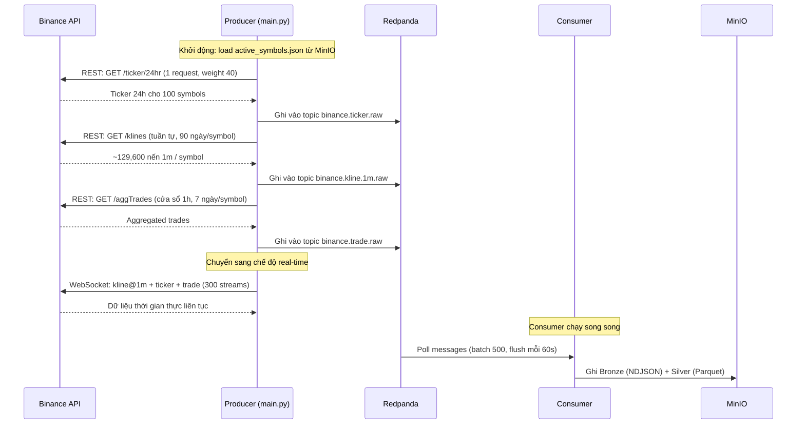
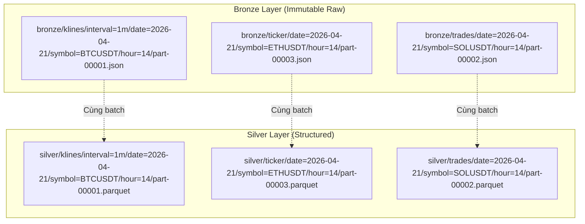
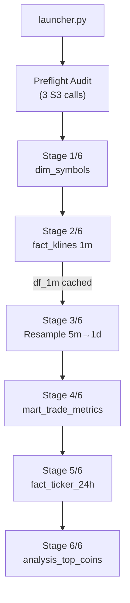
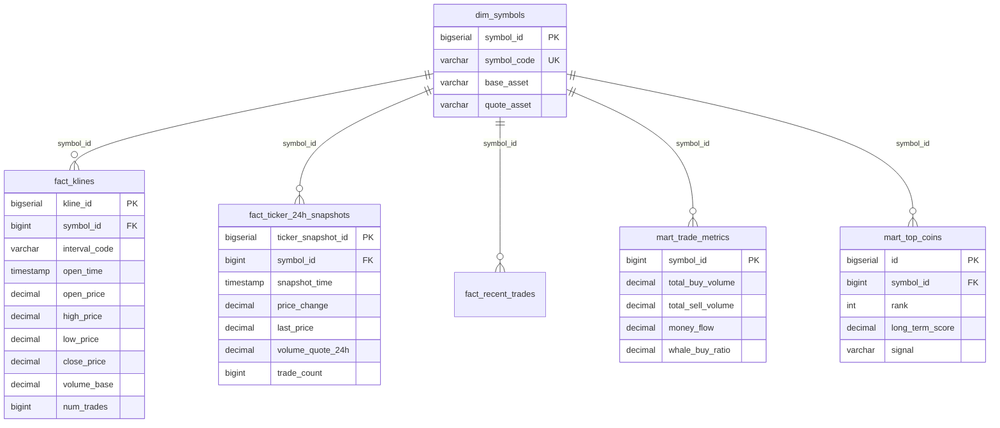
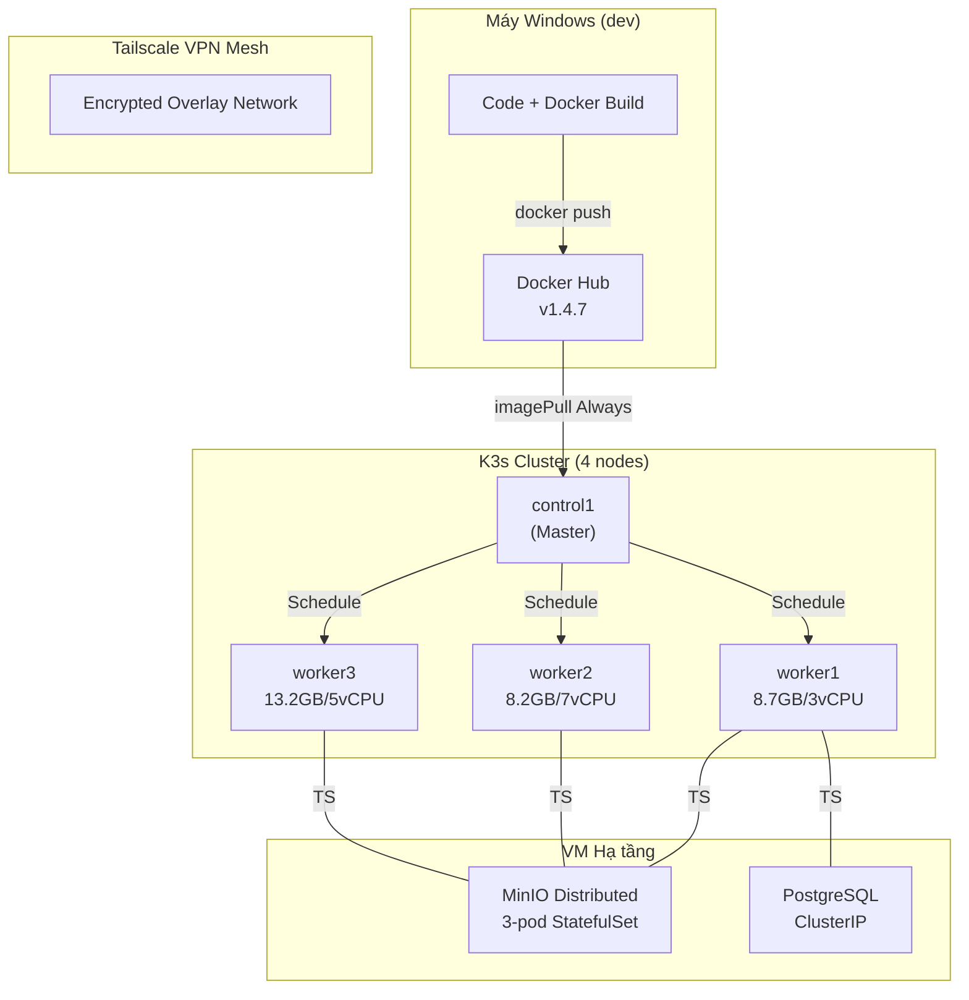

# CryptoDW — Hệ thống Data Warehouse Crypto thời gian thực

## Tổng quan

CryptoDW là một hệ thống **Data Warehouse** quy mô lớn, thu thập và phân tích dữ liệu thị trường tiền điện tử từ sàn Binance cho **100 cặp giao dịch USDT có thanh khoản cao nhất**. Hệ thống xây dựng theo kiến trúc **Medallion Architecture** (Bronze → Silver → Gold), kết hợp xử lý batch lẫn streaming, triển khai trên cụm **Kubernetes (K3s)**.

---

## Công nghệ sử dụng

| Thành phần | Công nghệ | Vai trò |
|---|---|---|
| **Message Broker** | Redpanda (Kafka-compatible) | Hàng đợi trung gian giữa Producer và Consumer |
| **Data Lake** | MinIO (S3-compatible) | Lưu trữ dữ liệu thô và chuẩn hóa (Bronze + Silver) |
| **Compute Engine** | Apache Spark 3.5.4 | Xử lý ETL batch và streaming |
| **Data Warehouse** | PostgreSQL 16 | Tầng Gold — lưu dữ liệu phân tích sẵn sàng truy vấn |
| **Container Orchestration** | Kubernetes (K3s) | Quản lý vòng đời Spark Driver/Executor trên cụm |
| **VPN Mesh** | Tailscale | Kết nối mạng an toàn giữa các VM phân tán |
| **Ingestion** | Python (asyncio + aiohttp + websockets) | Thu thập dữ liệu từ Binance REST API và WebSocket |
| **Serialization** | PyArrow + Snappy | Ghi Parquet nén hiệu quả tại tầng Silver |

---

## Kiến trúc tổng thể



---

## Luồng dữ liệu chi tiết

### Giai đoạn 1 — Thu thập dữ liệu (Ingestion)



**Producer (`main.py`)** thực hiện 2 pha:

1. **Bootstrap Phase**: Gọi Binance REST API để backfill dữ liệu lịch sử — 90 ngày nến 1m (129,600 nến/symbol) và 7 ngày aggTrades. Mỗi bản ghi được đẩy vào Redpanda qua `RedpandaStorage`.
2. **Streaming Phase**: Mở kết nối WebSocket đa luồng (mỗi connection tối đa 200 streams theo giới hạn Binance). Mỗi symbol theo dõi 3 stream: `@kline_1m`, `@ticker`, `@trade`. Dữ liệu thời gian thực được đẩy liên tục vào Redpanda.

**Redpanda** đóng vai trò message broker với 3 topics:

| Topic | Dữ liệu | Key |
|---|---|---|
| `binance.kline.1m.raw` | Nến 1 phút (OHLCV) | symbol |
| `binance.ticker.raw` | Ticker 24h snapshot | symbol |
| `binance.trade.raw` | Giao dịch cá nhân | symbol |

**Consumer (`consumer_to_minio.py`)** đọc từ cả 3 topic, sử dụng `BufferManager` để gom nhóm message theo khóa `(topic, symbol, date, hour)`. Khi buffer đạt ngưỡng 500 message hoặc hết 60 giây, dữ liệu được flush đồng thời vào 2 tầng:

- **Bronze**: JSON Lines (`part-00001.json`)
- **Silver**: Parquet nén Snappy (`part-00001.parquet`)

Cơ chế **Backpressure** tích hợp sẵn: nếu số message chưa flush vượt 500,000, consumer tạm dừng poll để tránh tràn bộ nhớ.

---

### Giai đoạn 2 — Lưu trữ Medallion (Data Lake)



#### Bronze Layer
- **Định dạng**: NDJSON (Newline Delimited JSON)
- **Mục đích**: Dữ liệu thô nguyên bản từ Binance API, không biến đổi. Đóng vai trò "bảo hiểm" — có thể tái xử lý nếu logic Silver/Gold thay đổi.
- **Schema**: Schema-less. Mỗi dòng JSON là một bản ghi độc lập.

#### Silver Layer
- **Định dạng**: Apache Parquet với nén Snappy
- **Schema chuẩn hóa**: Module `silver_schema.py` đảm bảo tất cả trường số (OHLCV) được ép kiểu về **STRING** trước khi ghi Parquet. Lý do: Binance REST API trả dữ liệu là string, nhưng WebSocket handler cast sang float. Nếu không ép kiểu thống nhất, PyArrow sẽ infer ra schema khác nhau giữa các file (lúc STRING, lúc DOUBLE), khiến Spark không đọc được.
- **Chiến lược phân vùng (Partitioning)**:
  - Klines: `interval={interval}/date={YYYY-MM-DD}/symbol={SYMBOL}/hour={HH}/`
  - Ticker: `date={YYYY-MM-DD}/symbol={SYMBOL}/hour={HH}/`
  - Trades: `date={YYYY-MM-DD}/symbol={SYMBOL}/hour={HH}/`
- **Lợi ích**: Spark tận dụng **Partition Pruning** — khi truy vấn dữ liệu của 1 ngày cụ thể, Spark chỉ đọc folder `date=2026-04-21/` thay vì scan toàn bộ bucket.

---

### Giai đoạn 3 — Xử lý ETL (Spark on Kubernetes)



Khi Kubernetes Job khởi chạy, Spark Driver thực thi **launcher.py** — bộ điều phối chính:

1. **Symbol Coordination**: Đọc file `metadata/active_symbols.json` từ MinIO (danh sách 100 symbol được theo dõi). File này là "Single Source of Truth" dùng chung giữa Producer và Spark.
2. **Preflight Audit**: Kiểm tra 3 prefix (`silver/klines/`, `silver/trades/`, `silver/ticker/`) có tồn tại và chứa dữ liệu không. Chỉ tốn 3 S3 API call (thay vì 300 call per-symbol giống phiên bản cũ).
3. **Orchestration**: Gọi `run_all.py` để thực thi tuần tự 6 stage ETL.

#### Chi tiết 6 Stage

**Stage 1 — dim_symbols** (`etl_dim_symbols.py`)
- Quét cấu trúc thư mục Silver trên MinIO bằng Hadoop `globStatus` để tìm danh sách symbol codes (BTCUSDT, ETHUSDT, ...).
- Tách `base_asset` và `quote_asset` từ symbol code (vd: `BTC` + `USDT`).
- Ghi vào bảng staging, sau đó UPSERT vào `dim_symbols` qua SQL `ON CONFLICT`.
- Bảng này cấp `symbol_id` (khóa chính) dùng cho mọi fact table.

**Stage 2 — fact_klines 1m** (`etl_klines.py`)
- Đọc **bulk** toàn bộ file Parquet từ `silver/klines/interval=1m/**/*.parquet`.
- Trích `symbol` từ đường dẫn file (`input_file_name()`) bằng regex, sau đó **Broadcast Join** với `dim_symbols` để lấy `symbol_id`.
- Ép kiểu (cast): OHLCV từ STRING → `Decimal(30,12)`, timestamp từ millisecond → `Timestamp`.
- Khử trùng (dedup) theo `(symbol_id, interval_code, open_time)`.
- Ghi staging → PostgreSQL UPSERT (`ON CONFLICT DO UPDATE`).
- **Trả về DataFrame cached** (`df_1m`) để Stage 3 tái sử dụng mà không cần đọc lại từ DB.

**Stage 3 — Resample** (`etl_klines_resample.py`)
- Nhận `df_1m` (cached) từ Stage 2.
- Sử dụng Spark `window()` function để gộp nến 1m thành 6 khung thời gian: **5m, 15m, 30m, 1h, 4h, 1d**.
- Thuật toán bảo toàn tính toàn vẹn nến:
  - `open_price` = giá mở cửa của nến **đầu tiên** trong window (`min_by` theo `open_time`)
  - `close_price` = giá đóng cửa của nến **cuối cùng** trong window (`max_by` theo `open_time`)
  - `high_price` = `MAX(high_price)` — đỉnh cao nhất tuyệt đối
  - `low_price` = `MIN(low_price)` — đáy thấp nhất tuyệt đối
  - `volume` = `SUM(volume)` — tổng khối lượng
- Mỗi interval được UPSERT riêng vào `fact_klines`.

**Stage 4 — mart_trade_metrics** (`etl_trades.py`)
- Đọc dữ liệu trades từ Silver layer.
- Tính toán **Money Flow** (dòng tiền): phân loại giao dịch mua chủ động (`is_buyer_maker=false`) vs bán chủ động.
- Phát hiện **Whale Signal** (tín hiệu cá mập):
  - Ngưỡng whale = `GREATEST(avg + 2σ, avg × 3)` — giao dịch lớn bất thường.
  - Tính `whale_buy_ratio`: tỉ lệ volume cá mập mua / tổng volume cá mập → chỉ báo áp lực mua/bán lớn.
- Ghi vào `mart_trade_metrics` (TRUNCATE + INSERT — snapshot toàn bộ).

**Stage 5 — fact_ticker_24h_snapshots** (`etl_ticker_24h.py`)
- Đọc dữ liệu ticker từ Silver layer.
- Mỗi snapshot được gắn nhãn thời gian theo giờ (hour-grain): `snapshot_time = date + hour + ":00:00"`.
- Ép kiểu (cast): các trường giá từ camelCase (nguồn Binance) sang snake_case + `Decimal(30,12)`.
- Dedup theo `(symbol_id, snapshot_time)` rồi UPSERT vào PostgreSQL.

**Stage 6 — analysis_top_coins** (`analysis_top_coins.py`)
- Nguồn dữ liệu: `fact_klines` (interval 1d) + `mart_trade_metrics` + `dim_symbols` — tất cả đọc từ PostgreSQL.
- Tính **Long-term Score** (điểm đầu tư dài hạn) cho mỗi symbol bằng 5 chỉ số:
  - `total_volume_quote` — tổng khối lượng giao dịch
  - `avg_taker_buy_ratio` — áp lực mua chủ động trung bình
  - `money_flow` — dòng tiền ròng
  - `whale_buy_ratio` — tỉ lệ mua cá mập
  - `bullish_ratio` — tỉ lệ nến xanh (close > open)
- Mỗi chỉ số được xếp hạng bằng `percent_rank()` toàn bộ universe, sau đó tính trung bình (trọng số đều 20% mỗi chỉ số).
- Gán tín hiệu: **ACCUMULATING** (tích lũy) / **NEUTRAL** / **DISTRIBUTING** (phân phối).
- Top 10 symbol được ghi vào `mart_top_coins` (mode append — tích lũy lịch sử mỗi lần ETL chạy).

---

### Giai đoạn 4 — Mô hình dữ liệu (Gold Layer — PostgreSQL)



| Bảng | Loại | Grain | Chiến lược ghi |
|---|---|---|---|
| `dim_symbols` | Dimension | 1 row / symbol | UPSERT |
| `fact_klines` | Fact | 1 row / (symbol, interval, open_time) | UPSERT |
| `fact_ticker_24h_snapshots` | Fact | 1 row / (symbol, hour) | UPSERT |
| `fact_recent_trades` | Fact | 1 row / (symbol, trade_id) | Streaming append |
| `mart_trade_metrics` | Mart | 1 row / symbol | TRUNCATE + INSERT |
| `mart_top_coins` | Mart | 1 row / (timeframe, rank, computed_at) | APPEND (lịch sử) |

---

## Hạ tầng triển khai

### Kiến trúc mạng



- **Spark Driver Pod**: 3 GB RAM + 768 MB overhead, 1 Core — điều phối DAG, giao tiếp JDBC với PostgreSQL.
- **Spark Executor Pods**: 3 instances × 6 GB RAM + 768 MB overhead, 3 Core — mỗi executor chạy trên 1 worker node riêng.
- **S3A Protocol**: Spark đọc MinIO qua S3A với `path.style.access=true`. Dùng **directory path** (1 recursive LIST call) thay vì wildcard glob (250k+ LIST calls) để tránh bottleneck trên Tailscale.
- **Tailscale**: Mọi traffic giữa Spark, MinIO và PostgreSQL đi qua tunnel mã hóa end-to-end.

### Tối ưu hiệu năng (Phase B — v1.4.7)

| Tham số | Giá trị | Tác dụng |
|---|---|---|
| `--executor-memory` | 6g | Tăng từ 4g — tận dụng RAM worker còn trống |
| `--executor-cores` | 3 | Tăng từ 2 — 3 task song song / executor |
| `spark.executor.memoryOverhead` | 768m | Off-heap buffer cho shuffle/S3A |
| `fs.s3a.threads.max` | 50 | Tăng từ 20 — đọc MinIO nhanh hơn |
| `fs.s3a.connection.maximum` | 100 | Tăng từ 50 — pool kết nối S3A lớn hơn |
| `fs.s3a.fast.upload` | true | ByteBuffer upload — giảm latency ghi MinIO |
| `sql.files.maxPartitionBytes` | 256 MB | Merge nhiều Parquet nhỏ thành ít partition lớn |
| `parallelPartitionDiscovery.parallelism` | 32 | 32 thread list S3 song song khi scan schema |
| JDBC `batchsize` | 10000 | Tăng từ 2000 — ghi Postgres nhanh hơn 5× |
| JDBC `numPartitions` | 4 | 4 kết nối song song khi ghi staging table |
| `reWriteBatchedInserts` | true | PostgreSQL driver gộp nhiều VALUES vào 1 statement |
| GC | G1GC (driver + executor) | Giảm GC pause trong quá trình shuffle lớn |

---

## Cấu trúc thư mục dự án

```
BINANCE-DATA-1M-RESTAPI/
├── main.py                       # Entry point — Producer (REST + WebSocket)
├── redpanda_storage.py           # Kafka producer wrapper (Redpanda)
├── rest_collector.py             # REST API client (backfill klines, trades, ticker)
├── ws_collector.py               # WebSocket client (real-time streaming)
├── consumer_to_minio.py          # Consumer: Redpanda → MinIO (Bronze + Silver)
├── silver_schema.py              # Chuẩn hóa kiểu dữ liệu trước khi ghi Parquet
├── s3_utils.py                   # Tiện ích MinIO (load/save active_symbols)
├── config.py                     # Cấu hình tập trung (Ingestion Layer)
│
├── docker-compose.yml            # Hạ tầng local: Redpanda + Console
├── docker-compose.processing.yml # Stack xử lý local: Spark + PostgreSQL
│
├── scripts/                      # === Công cụ vận hành ===
│   ├── scan_silver_schemas.py    #   Phát hiện file Parquet có schema sai (DOUBLE thay STRING)
│   └── rewrite_mixed_parquet.py  #   Rewrite file DRIFT: ép DOUBLE → STRING in-place trên MinIO
│
├── spark_processing/             # === Spark ETL Production Image (v1.4.7) ===
│   ├── Dockerfile                #   Image build (apache/spark:3.5.4 + JAR)
│   ├── config.py                 #   Cấu hình Spark (MinIO endpoint, VERSION)
│   ├── build_and_push.sh         #   Script build + push lên Docker Hub
│   └── jobs/
│       ├── launcher.py           #     Điều phối: preflight audit + orchestrate + tee log
│       ├── run_all.py            #     6-stage pipeline với timing log + tổng thời gian
│       ├── etl_utils.py          #     SparkSession (S3A, AQE, G1GC, parallel discovery)
│       ├── etl_dim_symbols.py    #     Stage 1: Symbol dimension
│       ├── etl_klines.py         #     Stage 2: Fact klines 1m (bulk + JDBC x4 parallel)
│       ├── etl_klines_resample.py#     Stage 3: Resample 1m → 5m/15m/30m/1h/4h/1d
│       ├── etl_trades.py         #     Stage 4: Trade metrics + whale detection
│       ├── etl_ticker_24h.py     #     Stage 5: Ticker 24h snapshots
│       └── analysis_top_coins.py #     Stage 6: Top 10 scoring + tín hiệu ACCUMULATING/NEUTRAL/DISTRIBUTING
│
├── k8s/                          # === Kubernetes Manifests ===
│   ├── job.yaml                  #   Spark Job (Driver + Executors + resource limits)
│   ├── rbac.yaml                 #   ServiceAccount + RBAC cho Spark
│   ├── secret.yaml               #   Credentials (MinIO, PostgreSQL, Binance)
│   ├── configmap.yaml            #   Cấu hình environment
│   └── postgres-stack.yaml       #   PostgreSQL StatefulSet + PVC + Service
│
└── postgres/
    └── init.sql                  # DDL: Tạo schema Data Warehouse (6 bảng)
```

---

## Hướng dẫn vận hành

### Khởi động hạ tầng Ingestion (máy local)

```bash
# 1. Khởi động Redpanda
docker compose up -d

# 2. Chạy Producer (Terminal 1)
python main.py

# 3. Chạy Consumer (Terminal 2)
python consumer_to_minio.py
```

### Triển khai Spark ETL trên Kubernetes

```bash
# Build và push image (chạy trên Windows)
cd spark_processing
docker build -t huytrongbeou1310/bigdata_spark_postgresql:v1.4.7 .
docker push huytrongbeou1310/bigdata_spark_postgresql:v1.4.7

# Triển khai Job (chạy trên control1)
kubectl delete job -n spark-etl spark-etl-submitter --ignore-not-found
kubectl apply -f k8s/job.yaml

# Theo dõi logs (2 cách)
# Cách 1: stream trực tiếp (có thể bị ngắt do Tailscale)
kubectl logs -f -n spark-etl -l spark-role=driver

# Cách 2: copy file log ra — ổn định hơn qua mạng không tốt
kubectl cp spark-etl/<driver-pod-name>:/tmp/etl_run.log /tmp/etl_run.log
tail -50 /tmp/etl_run.log

# Dọn dẹp sau khi chạy xong
kubectl delete all -n spark-etl
```

### Schema drift — Công cụ xử lý

Nếu Spark báo lỗi `Parquet column cannot be converted: Expected STRING, Found DOUBLE`, dùng 2 script trong `scripts/`:

```bash
# 1. Scan toàn bộ Silver layer, tìm file có schema sai
python scripts/scan_silver_schemas.py --topic klines --out /tmp/klines_scan.csv

# 2. Rewrite các file DRIFT: ép DOUBLE → STRING in-place trên MinIO
python scripts/rewrite_mixed_parquet.py --input /tmp/klines_scan.csv
```

---

*Phiên bản hiện tại: v1.4.7 — Phase B: Aggressive Performance Tuning*
